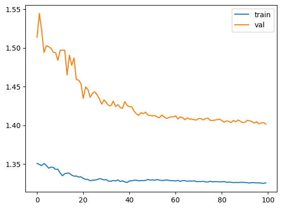

# Baseline Model

**[Notebook](1st_submition_epicfail
/baseline_model_otimizado_by_night.ipynb)**

## Baseline Model Results

### Model Selection
- **Baseline Model Type:** 3-layer 1D Convolutional Neural Network (CNN)
- **Rationale:**  
  This architecture corresponds to the reference baseline provided by the Dreem Sleep Apnea Detection Challenge.  
  It processes raw polysomnography (PSG) signals sampled at 100 Hz without handcrafted features and downsamples the temporal resolution to 1 Hz, directly matching the annotation frequency.  
  The model serves as a strong and standardized baseline before introducing more complex temporal modeling (e.g., recurrent layers or attention mechanisms).

---

### Model Training

The figure above shows the evolution of training and validation loss throughout the optimization process.
A gradual decrease in validation loss indicates stable convergence without signs of severe overfitting.
The slow but consistent improvement at lower learning rates highlights the importance of extended training for this task.

---

### Model Performance

The model was evaluated using both **window-level** and **event-level** metrics.  
The official challenge ranking is based on an **event-level F1-score with IoU-based matching**, which is reported below.

| Metric | Dataset | Score |
|------|--------|-------|
| Event-based F1 (IoU ≥ 0.3) | Validation | **0.247** |
| Event-based F1 (IoU ≥ 0.3) | Test (official) | **0.074** |
| Percentage of positive seconds (post-processed) | Validation | **7.77%** |
| Percentage of positive seconds (post-processed) | Test | **≈ 8–9%** |

**Post-processing parameters (best validation configuration):**
- Threshold (`t`): 0.57  
- Minimum event duration (`min_len`): 12 seconds  
- Gap filling (`gap_fill`): 3 seconds  

---

### Evaluation Methodology

- **Data Split:**  
  - Subject-wise split to avoid data leakage  
  - 22 subjects for training  
  - 7 subjects for validation  
  - 22 held-out subjects for test (challenge submission)

- **Evaluation Metrics:**
  - **Event-based F1-score with IoU matching (≥ 0.3)** — official challenge metric  
  - **Percentage of positive seconds** after post-processing — used for calibration and sanity checks  

- **Event Definition:**  
  Binary segmentation masks at 1 Hz were converted into temporal events.  
  Predicted and reference events were matched using Intersection-over-Union (IoU), and precision/recall were computed at the event level.

---

### Metric Practical Relevance

- **Event-based F1-score:**  
  This metric evaluates whether apnea events are detected as coherent temporal episodes rather than isolated time points.  
  It strongly penalizes fragmented detections and false positive events, making it clinically more relevant than per-second accuracy.

- **Percentage of Positive Seconds:**  
  Used as a diagnostic metric to ensure that model predictions are physiologically plausible and aligned with the prevalence observed in training data.  
  Large deviations often indicate overly conservative or overly aggressive thresholds.

In practice, a high event-based F1-score indicates that the model detects apnea events with correct timing and duration, which is critical for downstream clinical interpretation and severity estimation.

---

## Next Steps

While the baseline CNN is capable of detecting coarse apnea patterns, its performance is limited by the lack of explicit long-range temporal modeling.  
The next phase focuses on improving event coherence and boundary localization by introducing:
- Temporal aggregation across full nights
- Recurrent layers (GRU/LSTM) on top of frozen CNN features
- Improved loss functions and smoothing strategies aligned with event-level evaluation

This baseline serves as a reference point for evaluating more advanced architectures in the **Model Definition and Evaluation** phase.
